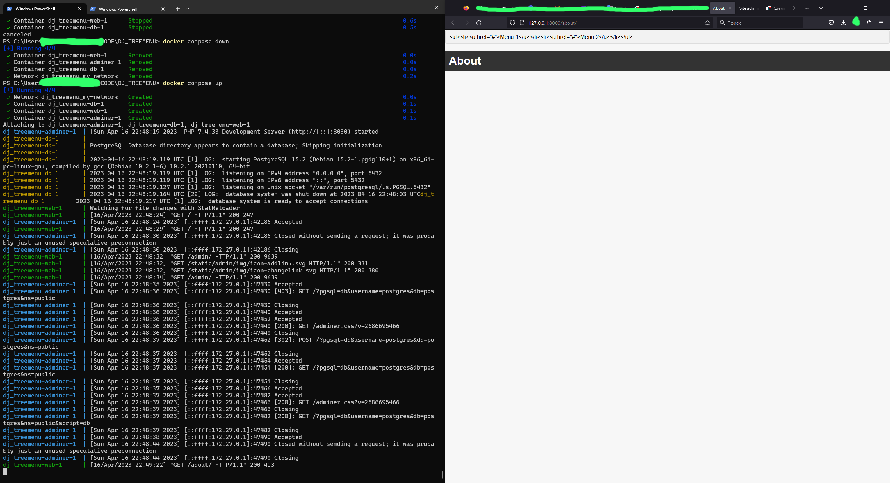
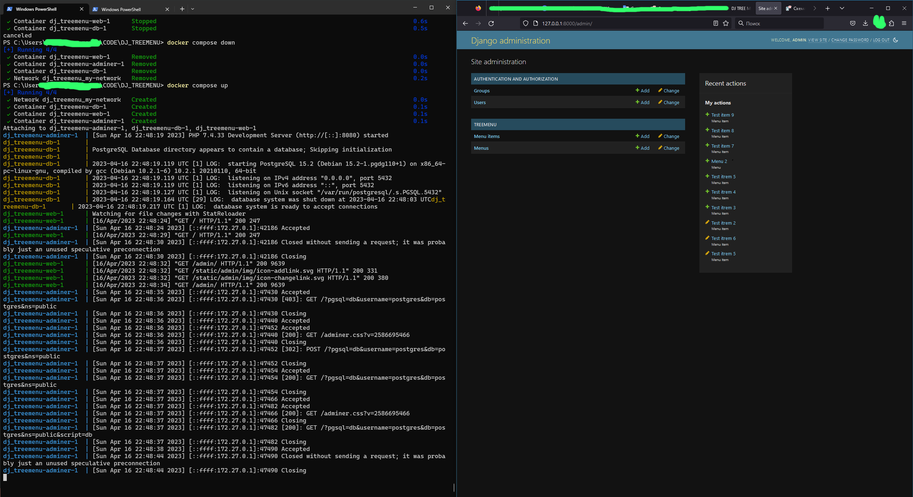
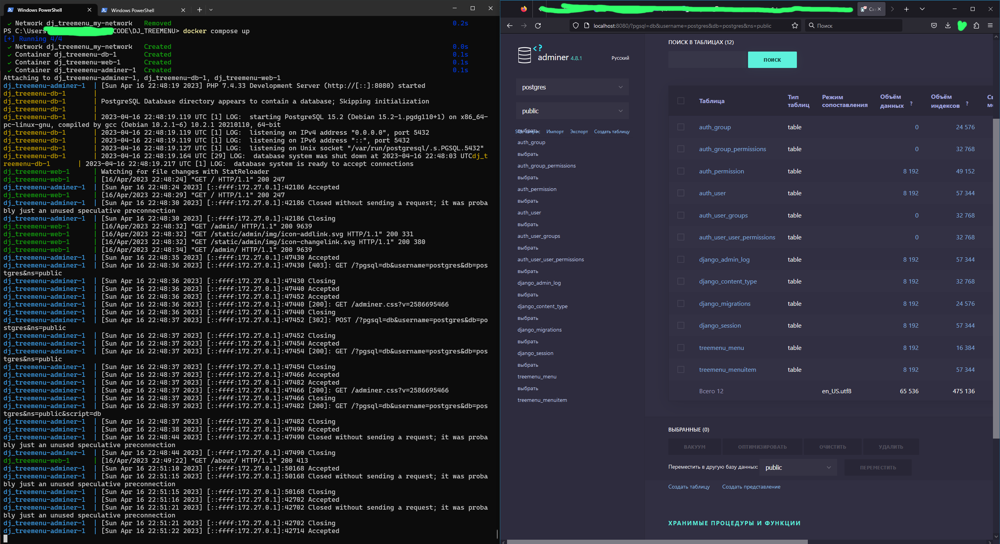

# DJ TREE MENU 

| UPTRADER

**Django + PostgreSQL + Adminer**

```
docker compose up --build

docker compose up
docker compose down
```

Данные окружения, их нужно скопировать в созданный файл `.env`:
```
DJ_ADM_L='admin'
DJ_ADM_P='admin'

DB_HOST='db'
DB_NAME='postgres'
DB_USER='postgres'
DB_PASSWORD='password'

SECRET_KEY="django_secret_key"
```

## Задача


Нужно сделать django app, который будет реализовывать древовидное меню, соблюдая следующие условия:


1) Меню реализовано через template tag
2) Все, что над выделенным пунктом - развернуто. Первый уровень вложенности под выделенным пунктом тоже развернут.
3) Хранится в БД.
4) Редактируется в стандартной админке Django
5) Активный пункт меню определяется исходя из URL текущей страницы
6) Меню на одной странице может быть несколько. Они определяются по названию.
7) При клике на меню происходит переход по заданному в нем URL. URL может быть задан как явным образом, так и через named url.
8) На отрисовку каждого меню требуется ровно 1 запрос к БД


Нужен django-app, который позволяет вносить в БД меню (одно или несколько) через админку, и нарисовать на любой нужной странице меню по названию.


``


При выполнении задания из библиотек следует использовать только Django и стандартную библиотеку Python.


При решении тестового задания у вас не должно возникнуть вопросов. Если появляются вопросы, вероятнее всего, у вас недостаточно знаний. Задание выложить на гитхаб.


PS: задание можно найти в публичном доступе https://yandex.ru/q/pythontalk/12774643458/

Решения тодже есть в общем доступе.


## Конфигурирование

Статика и PostgreSQL.
### STATIC

Изменим директории в `settings.py`:
```
STATIC_URL = '/static/'


STATICFILES_DIRS = [
    os.path.join(BASE_DIR, 'static'),
]


STATIC_ROOT = os.path.join(BASE_DIR, 'staticfiles')
```

Соберём статику:
```
python manage.py collectstatic
```
Добавим `djangoapp/static/treemenu/css/style.css` для того чтобы в нашем проекте был стиль.
### PostgreSQL

Для подключения `PostgreSQL` нужно: установить `psycopg2`,  изменить насторйки в `settings.py`:
```
pip install psycopg2
```
```
DATABASES = {
    'default': {
        'ENGINE': 'django.db.backends.postgresql',
        'NAME': os.getenv("DB_NAME"),
        'USER': os.getenv("DB_USER"),
        'PASSWORD': os.getenv("DB_PASSWORD"),
        'HOST': os.getenv("DB_HOST"),
        'PORT': '5432',
    }
}
```

Далее нужно сделать миграцию и создать админа. Команды нужно выполнять в контейнере с Django:

Запущенные контейнеры:
```
$ docker compose ps
NAME                    IMAGE               COMMAND                  SERVICE             CREATED              STATUS              PORTS
dj_treemenu-adminer-1   adminer             "entrypoint.sh php -…"   adminer             About a minute ago   Up About a minute   0.0.0.0:8080->8080/tcp
dj_treemenu-db-1        postgres:latest     "docker-entrypoint.s…"   db                  About a minute ago   Up About a minute   0.0.0.0:5432->5432/tcp
dj_treemenu-web-1       dj_treemenu-web     "python manage.py ru…"   web                 About a minute ago   Up About a minute   0.0.0.0:8000->8000/tcp
```

Подключаемся к `dj_treemenu-web-1`:
```
docker exec -it dj_treemenu-web-1 bash
```

Миграции:
```
python manage.py makemigrations
python manage.py migrate
```

Суперпользователь:
```
python manage.py createsuperuser
```

### Добавление записей в БД

Их можно добавить в админке джанго или в adminer, также это можно сделать через `django shell`:
```
docker exec -it dj_treemenu-web-1 bash

root@3bc255dec306:/code# ls
__pycache__  djangoapp  manage.py  menu_data.py  static  templates  treemenu  venv

root@3bc255dec306:/code# python -V
Python 3.11.3

root@3bc255dec306:/code# python manage.py shell
```

Вставляем следующий код:
```
from treemenu.models import MenuItem

# Создание первой записи
menu_item1 = MenuItem.objects.create(
    name='Home',
    parent=None,
    url='/'
)

# Создание второй записи
menu_item2 = MenuItem.objects.create(
    name='About',
    parent=None,
    url='/about/'
)

# Создание третьей записи, которая будет дочерней для первой
menu_item3 = MenuItem.objects.create(
    name='Contact',
    parent=None,
    url='/contact/'
)
```
### Добавление кастомной 404

Очевидно, это не обязательный пункт этого задания, но пусть будет здесь.

`views.py`:
```
def page_not_found_view(request, exception):
    return render(request, '404.html', status=404)
```
`urls.py`:
```
handler404 = "treemenu.views.page_not_found_view"
```

Файл кастомной страницы: `djangoapp/templates/404.html`


### PostgresSQL

Заходим в контейнер:
```
docker exec -it dj_treemenu-db-1 bash
```

Список БД пользователя (`-U postgres`):
```
root@11621eac194b:/# psql -U postgres -l
                                                List of databases
   Name    |  Owner   | Encoding |  Collate   |   Ctype    | ICU Locale | Locale Provider |   Access privileges
-----------+----------+----------+------------+------------+------------+-----------------+-----------------------        
 postgres  | postgres | UTF8     | en_US.utf8 | en_US.utf8 |            | libc            |
 template0 | postgres | UTF8     | en_US.utf8 | en_US.utf8 |            | libc            | =c/postgres          +        
           |          |          |            |            |            |                 | postgres=CTc/postgres
 template1 | postgres | UTF8     | en_US.utf8 | en_US.utf8 |            | libc            | =c/postgres          +        
           |          |          |            |            |            |                 | postgres=CTc/postgres
(3 rows)
```

Дроп БД:
```
root@11621eac194b:/# dropdb -U postgres postgres
```

Создание БД:
```
root@a9bceb527d59:/# createdb -U postgres postgres
```

## Решение

Задача ещё не решена. Я не стал пользоваться чужими решениями.

Я создал `template tag`:`djangoapp\treemenu\templatetags\menu_tags.py`, подключил `postgres`. Создал модели `Menu` и `MenuItem`, заполнил их в админке джанго.

Я понял задания так, что в итоге у нас должно быть `nav` меню на всех страницах проекта с разными пунктам (беру из  модели `Menu`), при нажатии на пункт должен открываться древовидный список из модели `MenuItem`; для каждого пункта меню он свой. Использовать можно только стандартные средства django (нельзя `mptt` например).

Для решения я развернул среду `Django + PostgreSQL + Adminer` в `docker-compose`.


Сейчас не рендерится `nav` меню:


Админка:


Adminer:
